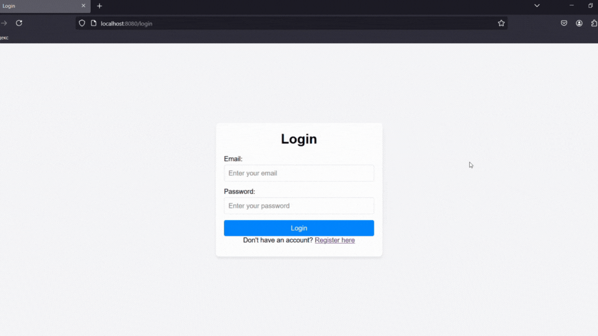
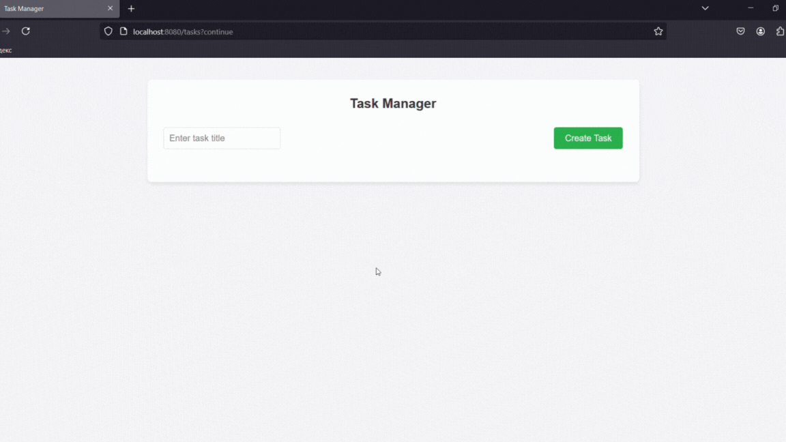
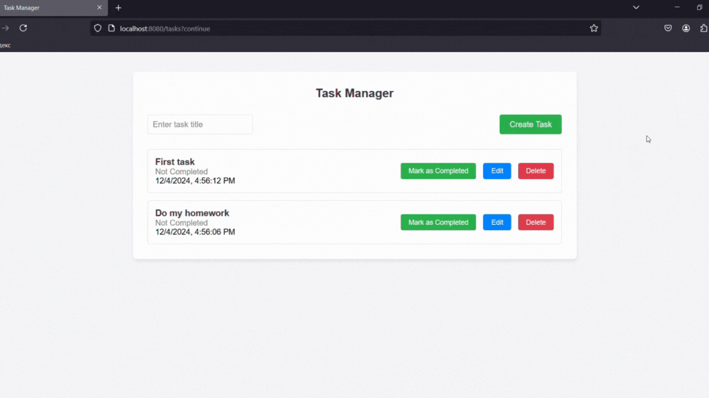

# Task Manager Project
This is the Task Manager Spring Boot project

## Overview
The project is designed to create tasks/notes by users. Also, in order to use the functionality of the application, the user must register and log in.
This project provides the following functionality:
  - view all your tasks;
  - create a task; 
  - update the task content;
  - delete a task;
  - mark the task as completed.

## Technologies
This project is implement using the following technologies:

  - Java 17
  - Spring Boot 3.3.5
  - PostgreSQL 16.3
  - Lombok
  - HTML
  - CSS
  - JavaScript
  - Docker

## Demonstration

#### Registration and Login

<br><br>
#### The main functionality

<br><br>
#### Deleting tasks

<br><br>

## Installation

```bash
# Clone the repository
git clone https://github.com/AstafevDan/task-manager.git

# Change into the project directory
cd your-project
```

Then: 
  1. Add a file **.env** to the root of the project with the following variables
     ```
     DB_URL=(enter your JDBC URL for Postgres)
     DB_USERNAME=(enter your username)
     DB_PASSWORD=(enter your password)
     ```
  2. Add a directory called secrets to the root of the project. Create files in this directory: db_password.txt with your DB password and db_username.txt with the name of the database user.

The application is ready to launch. In the command line at the root of the project, type (You need Docker installed on your computer):
  ```bash
  #Build, create and start containers
  docker compose up -d
  ```

Open in your browser the following address: http://localhost:8080/login
